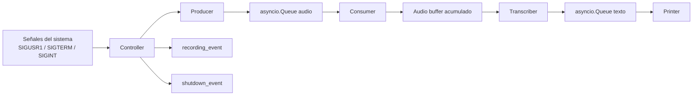
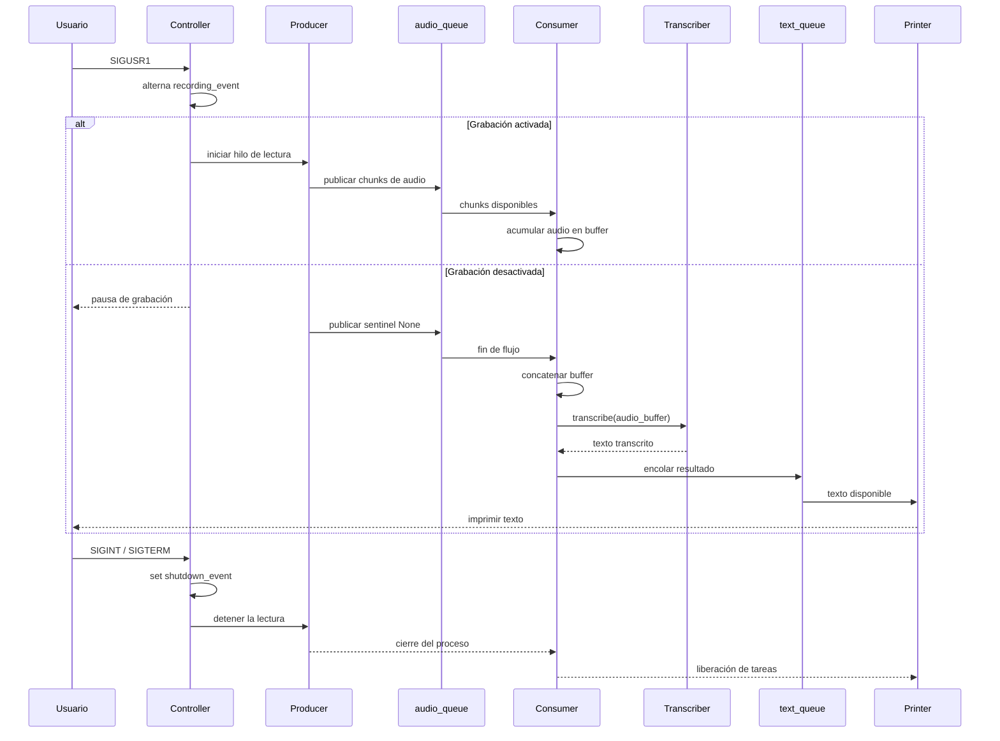

# Dictate

## Descripción general

Dictate es una aplicación de transcripción de voz orientada a la captura de audio desde un micrófono local y a la generación posterior de texto mediante un modelo de reconocimiento automático del habla. La implementación se basa en un patrón de productor-consumidor en el que la captura del audio y la transcripción están separadas por una cola de eventos y por una coordinación explícita del ciclo de vida del programa.

El proyecto se compone de varios módulos que interactúan mediante colas asíncronas y eventos de sincronización. El punto de entrada principal orquesta la ejecución y gestiona la vida útil del proceso, mientras que los componentes específicos se encargan de la lectura del audio, la serialización de fragmentos, la transcripción con Faster Whisper y la presentación del texto resultante.

## Objetivos del sistema

El diseño persigue cinco objetivos principales:

- Capturar audio continuo desde el dispositivo de entrada por defecto.
- Permitir activar y desactivar la grabación sin interrumpir el proceso principal.
- Acumular fragmentos de audio durante la sesión de grabación hasta completar la captura.
- Ejecutar la transcripción sobre el conjunto de audio recogido una vez finalizada la grabación.
- Finalizar la ejecución correctamente cuando el usuario solicita cerrar la aplicación.

## Arquitectura funcional

La arquitectura del sistema se puede describir como un pipeline concurrente con dos ejes fundamentales: control del ciclo de vida y flujo de datos de audio durante la grabación.



En esta estructura, el módulo de control decide si la adquisición de audio está activa o no, pero la transcripción no se inicia hasta que la grabación ha finalizado y el consumidor recibe el marker de cierre del flujo. De este modo, el pipeline de audio y el pipeline de texto están separados por una etapa de buffering y consolidación del material capturado.

## Módulos del proyecto

### 1. main.py

El archivo principal actúa como orquestador de la aplicación. En el punto de entrada se inicializa el bucle de eventos de asyncio, se crean los eventos de control y las colas de comunicación, y se instancian los componentes del sistema.

La ejecución sigue este esquema:

- Se crea un `asyncio.Event` para la señal de apagado limpio.
- Se crea un `threading.Event` para indicar si la grabación está activa o pausada.
- Se instancian dos colas asíncronas: una para fragmentos de audio y otra para transcripciones.
- Se inicializan `Producer`, `Transcriber`, `Consumer` y `Controller`.
- Se registran manejadores para `SIGUSR1`, `SIGTERM` y `SIGINT`.
- Se ejecutan las tareas de consumo y salida de texto.
- El proceso espera a que la señal de cierre se dispare y, entonces, realiza limpieza final.

El comportamiento principal es declarativo y de alto nivel: todo el estado del sistema queda gestionado desde un único punto de coordinación, que es la función `main()`.

### 2. controller.py

El controlador encapsula la lógica de control del ciclo de vida del programa. Su responsabilidad no es transcribir ni leer audio, sino coordinar la activación y desactivación de la captación, así como ejecutar un cierre ordenado de la aplicación.

Sus elementos más relevantes son:

- `toggle_recording()`: alterna el estado del `recording_event`.
- Si la grabación pasa a estar activa y no existe un hilo de captura vivo, se inicia un nuevo hilo ejecutando `Producer.produce(...)`.
- Si la grabación se desactiva, el hilo ya no lee más muestras del micrófono, pero el programa continúa en ejecución hasta que se decida cerrar de forma explícita.
- `exit_gracefully()`: limpia la bandera de grabación y establece `shutdown_event`, lo que desencadena la finalización del proceso principal.
- `wait_for_audio_thread()`: espera a la finalización del hilo de audio antes de cerrar la aplicación.

La decisión de que el hilo de captura viva fuera del bucle principal es importante: la lectura del micrófono debe continuar sin bloquear el loop principal de la interfaz asíncrona ni impedir la gestión de señales.

### 3. producer.py

El componente `Producer` es el encargado de la adquisición del audio desde el dispositivo de entrada. Se implementa con `sounddevice.InputStream`, una biblioteca que permite abrir un flujo continuo del micrófono en modo de captura.

La configuración del flujo es la siguiente:

- `samplerate = 16_000 Hz`
- `blocksize = 1024` muestras por bloque
- `channels = 1` (modo mono)
- `dtype = "float32"`

El método `produce(...)` se ejecuta en un hilo independiente y sigue este esquema:

1. Abre un `InputStream` del micrófono.
2. Mientras `recording_event` siga activo, lee bloques de audio.
3. Si se produce un desbordamiento, imprime un aviso en consola.
4. Publica cada bloque en la cola de audio mediante `loop.call_soon_threadsafe(queue.put_nowait, chunk)`.
5. Cuando la grabación termina, inserta un valor sentinel `None` para indicar el fin del flujo y desbloquear el consumidor.

Este patrón permite desacoplar la lectura del micrófono de la fase de transcripción sin bloquear la ejecución del bucle principal. El uso de `call_soon_threadsafe` es esencial porque el productor trabaja en un hilo distinto y el consumidor opera dentro del loop de asyncio.

### 4. consumer.py

El consumidor se encarga de reensamblar los fragmentos de audio capturados durante la grabación y, únicamente cuando recibe la señal de finalización del flujo, los envía al transcriptor. Su lógica es relativamente simple, pero crítica desde el punto de vista del procesamiento:

- Recupera bloques sucesivos de la cola `audio_queue`.
- Los acumula en una lista hasta encontrar el sentinel `None`.
- Cuando recibe el fin del flujo, concatena todos los arrays con `np.concatenate(chunks)`.
- Aplica `.squeeze()` para reducir dimensiones cuando es necesario.
- Invoca `transcriber.transcribe(audio_array)` en un hilo auxiliar mediante `asyncio.to_thread(...)`.
- Inserta el texto resultante en `text_queue`.

La decisión de agrupar fragmentos tiene una finalidad práctica: la transcripción se realiza sobre el conjunto completo de audio recogido al finalizar la grabación, evitando una transcripción fragmentada por bloque y mejorando la continuidad del texto emitido.

### 5. transcriber.py

La transcripción se delega a `faster-whisper` mediante la clase `Transcriber`.

El constructor crea una instancia de `WhisperModel` con los siguientes valores por defecto:

- `model_size = "base"`
- `device = "cpu"`
- `compute_type = "int8"`

La transcripción se ejecuta en el método `transcribe(audio)`:

- Llama a `self.model.transcribe(audio)`.
- Obtiene los segmentos generados por el modelo.
- Une el contenido textual de cada segmento con espacios.
- Elimina espacios redundantes con `.strip()`.

Este diseño ofrece un punto de extensión claro para futuras mejoras, como cambiar el modelo, utilizar GPU, ajustar la precisión computacional o incorporar postprocesado del texto.

### 6. printer.py

La salida visual del sistema se realiza mediante la clase `Printer`. Su funcionamiento es muy simple:

- Espera elementos en `text_queue`.
- Cuando llega una transcripción, la extrae con `text_queue.get()`.
- La imprime por consola con `print(result)`.

Aunque parezca trivial, este módulo establece un flujo de salida independiente del resto del pipeline, lo que facilita la extensión del comportamiento de visualización sin tocar la lógica de transcripción.

## Secuencia de ejecución

El flujo del sistema puede resumirse en la siguiente secuencia:



## Interacción entre hilos y bucle de eventos

El proyecto combina dos modelos de ejecución de Python:

- `asyncio` para la coordinación del flujo principal y la gestión de colas asíncronas.
- `threading` para la lectura del micrófono en segundo plano.

Esta división es necesaria porque la captura del micrófono no debe bloquear la ejecución del bucle principal ni detener la respuesta a señales del sistema. La consecuencia es que la cola de audio se convierte en un punto de sincronización entre dos contextos de ejecución distintos.

La coordinación se realiza así:

- El productor escribe en la cola desde un hilo distinto.
- El consumidor lee la cola desde el loop asíncrono.
- La operación `loop.call_soon_threadsafe(...)` garantiza que la inserción de elementos en la cola se haga en el contexto correcto del loop.

## Gestión de señales y cierre

El programa está diseñado para responder a tres señales del sistema:

- `SIGUSR1`: alterna entre grabación activa y pausa.
- `SIGTERM`: indica cierre ordenado del programa.
- `SIGINT`: equivalente a interrupción del usuario, utilizado para finalizar la ejecución desde el terminal.

En todos los casos, el cierre se gestiona a través de `shutdown_event`, que permite que la aplicación abandone su bucle de espera de forma controlada y termine sus tareas pendientes antes de salir.

## Dependencias

El proyecto depende de las siguientes bibliotecas principales:

- `faster-whisper`: motor de transcripción automática del habla.
- `numpy`: manipulación de arrays de audio.
- `sounddevice`: captura del micrófono.

El archivo de configuración del proyecto indica que la versión mínima de Python requerida es 3.12:

```toml
[project]
requires-python = ">=3.12"
```

## Requisitos de ejecución

Para ejecutar la aplicación se necesita:

- Python 3.12 o superior.
- Un dispositivo de audio disponible.
- Dependencias instaladas en el entorno del proyecto.

La instalación recomendada es:

```bash
python -m venv .venv
source .venv/bin/activate
pip install -e .
```

Y la ejecución:

```bash
python src/main.py
```

## Uso práctico

Una vez arrancado el programa, el proceso imprime el identificador del proceso y espera a que se reciba una señal. El flujo habitual es:

1. Iniciar la aplicación.
2. Enviar `SIGUSR1` para iniciar la grabación.
3. Hablar en el micrófono.
4. Enviar `SIGUSR1` nuevamente para pausar la grabación.
5. Enviar `SIGINT` o `SIGTERM` para cerrar la aplicación de manera ordenada.

El comportamiento se basa en un enfoque que prioriza continuidad y administración de eventos sobre una interfaz gráfica, por lo que es apropiado para entornos de consola y prototipos de automatización de dictado.

## Consideraciones técnicas y limitaciones

El sistema presenta varios aspectos que conviene considerar:

- La transcripción se realiza en CPU por defecto, lo que puede afectar la latencia si el modelo es más pesado o la carga del sistema aumenta.
- La cola de audio y la cola de texto tienen un tamaño máximo de 100 elementos, lo que permite limitar el consumo de memoria pero también introduce un punto de crecimiento potencial bajo carga sostenida.
- La captura se basa en bloque de 1024 muestras a 16 kHz, por lo que la latencia y la granularidad de la transcripción dependen directamente de esa configuración.
- La señal de cierre es segura en términos de coordinación, pero la aplicación no implementa una interfaz de usuario ni un registro estructurado de eventos ni métricas de rendimiento.
- La lógica actual no realiza transcripción incremental durante la grabación; el procesamiento completo se inicia después de la finalización de la captura.
